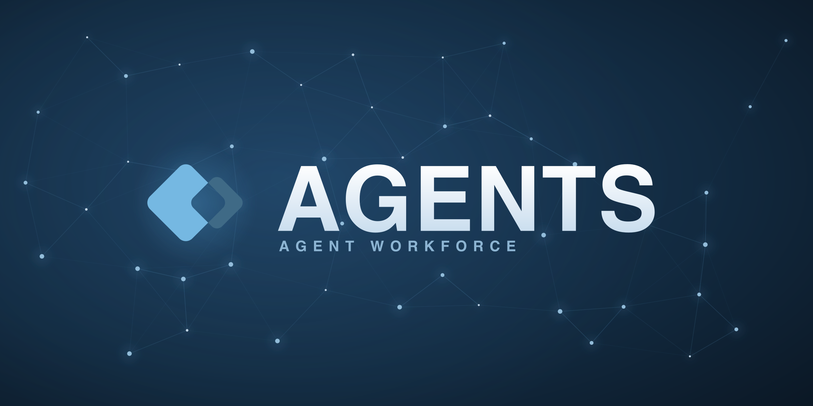

<p align="center">
  
</p>

**Agent Workforce.**
---
A collection of proactive agents. Each folder is a deployable agent — a typed
`persona.ts` (what it listens to + how it runs) and an `agent.ts` handler (what
it does). The persona compiles to `persona.json`; deploy with
`agentworkforce deploy ./<agent>/persona.json --mode cloud`.

## The agents

| Agent | Fires on | What it does |
| --- | --- | --- |
| [**granola**](granola/) | a new Granola note (Nango sync → `file.created`) | Detects prospect calls, files a Linear issue with the ask, and opens a GitHub PR implementing it. |
| [**hn-monitor**](hn-monitor/) | schedule (2×/day) | Scans Hacker News for your topics and posts a digest to Slack. |
| [**linear**](linear/) | Linear `issue.create` (labelled) / `comment.create` | Implements the issue and opens a GitHub PR; comments the PR link back. |
| [**repo-hygiene**](repo-hygiene/) | GitHub PR opened / updated | Diagnoses duplicated/dead code, divergent paths, stale skills/rules/docs, and code smells; comments findings and journals the run to Notion. |
| [**review**](review/) | GitHub PR opened / updated / reviewed / CI finished | Reviews the PR, fixes the issues it (and other bots) find, resolves failing CI and merge conflicts, DMs you when it's ready, and merges once you approve. |
| [**spotify-releases**](spotify-releases/) | schedule (daily) | Checks for new releases from artists you follow and DMs them to you. |
| [**vendor-monitor**](vendor-monitor/) | schedule (weekday mornings) | Watches the vendors in your stack for new releases and posts changes to your team channel. |

## How they're built

- **Typed authoring.** Personas use `definePersona` from `@agentworkforce/persona-kit`, so `integrations.<provider>.triggers[].on` autocompletes the provider's real events and is linted at deploy.
- **Integrations are VFS-backed.** Agents read/write providers (Slack, Linear, GitHub, Gmail/Google-Mail, Granola…) through the Relayfile VFS and the typed `ctx` clients — no direct API calls or tokens to manage.
- **Repos are materialized, not cloned.** For agents that touch code, the cloud materializes the GitHub repo into the sandbox (`ctx.sandbox.cwd`) via Relayfile, so handlers never run `git clone` — they just hand the work to the coding agent (`ctx.harness.run`).

## Run one locally

```sh
npm install
npm run typecheck                                   # tsc over every agent
agentworkforce persona compile ./hn-monitor/persona.ts
agentworkforce deploy ./hn-monitor/persona.json --mode cloud --input SLACK_CHANNEL=C0123ABCD
```
