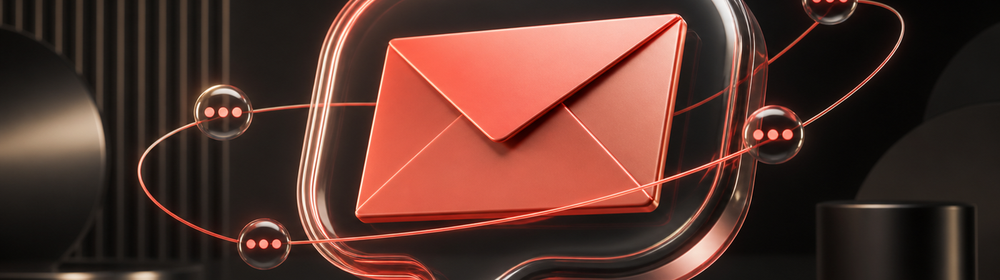

# inbox-buddy



Instantly launch this agent on Agent Relay

[](https://agentrelay.com/cloud/deploy?persona=https://github.com/AgentWorkforce/agents/blob/main/inbox-buddy/persona.ts)

Chat with this agent in a dedicated **Slack channel** to ask about your Gmail.
It holds a **multi-turn conversation** (remembers earlier turns) and reasons over
**full email threads** (not single messages).

```text
You → #your-channel:  What's the latest on the Q3 export thread with Alice?
inbox-buddy →         Alice will send the final Q3 numbers by Friday and looped in finance for sign-off.
You →                 Who did she loop in?
inbox-buddy →         finance@acme.com — she added them on the Jun 9 reply.
```

It exists as a **dogfooding forcing-function** for two things the platform keeps
getting wrong:

1. **Conversational continuity** — remembering context across your messages.
2. **Email threading** — resolving "that thread with X" to the right Gmail
   thread and reasoning over its whole message list.

## How it works

- **Channel:** the human chat path is **Slack**, not the relay inbox (the relay
  inbox is agent-to-agent). This mirrors the in-production `linear-slack` agent:
  a `slack` trigger watches ONE channel (`SLACK_CHANNEL`), and the handler
  answers every fresh human message there and replies in Slack. It ignores bot
  messages (loop guard) and message edits/joins.
- **Reads:** Gmail threads from the relayfile VFS at
  `/google-mail/threads/<id>.json` (provider id `google-mail`). No Gmail token —
  auth lives in the `google-mail` Nango connection. `lib/gmail.ts`.
- **Continuity:** the conversation transcript is persisted per-conversation in
  `ctx.memory` (workspace scope) and replayed into each prompt. Keyed on the
  Slack thread, or the channel itself for top-level messages, so a back-and-forth
  in the channel is one continuous conversation. `lib/conversation.ts`, `lib/slack.ts`.
- **Reasoning:** `ctx.llm.complete` (claude-sonnet-4-6) over a recent-thread
  overview plus the full message list of any thread the question references.
  `lib/prompt.ts`.

## Threading gaps this surfaced (the real deliverable)

1. **Relay inbox is agent-to-agent, not human→agent.** `relay: { inbox: ['@self'] }`
   only fires on a native relaycast DM to the agent — a human posting in Slack
   never reaches it. The human-facing channel is Slack (this agent), so the chat
   path was reworked from a relay-inbox trigger to a `slack` trigger.
2. **Relay chat would get no harness session-resume** (cloud derives conversation
   keys from Slack `thread_ts`), and `ctx.llm.complete` is stateless — so we
   persist/replay the transcript ourselves. cloud#2375.
3. **Stale mount path** — the materialized Gmail path is `/google-mail/**`, not
   the legacy `/gmail/...`; scoping `/gmail/**` would mount an empty tree.

## Inputs

| input | required | purpose |
|---|---|---|
| `SLACK_CHANNEL` | no | Optional: restrict replies to one Slack channel id. Unset = reply wherever inbox-buddy is `@mentioned`. (`app_mention` is webhook-driven, so the id is not interpolated into a watch path.) |

## Local testing

```bash
# golden tests (pure helpers + multi-turn continuity + email threading + slack gating + scope invariant)
npm test -- tests/inbox-buddy.test.mjs

# eval harness (routing/side-effects in simulate; real model + judge in live)
npm run evals -- --agent inbox-buddy
npm run evals:live -- --judge --agent inbox-buddy
```

Seeds live in `evals/seeds/gmail-thread-*.json`; chat cases (incl. the multi-turn
continuity case) in `evals/cases.jsonl`.

> Note: the full delivery path (Slack message → cloud dispatcher → handler →
> reply) is the same rail the in-production `linear-slack` agent uses. The local
> cloud-delivery mirror (`cloud/dev-stack make dev`) needs Docker.
