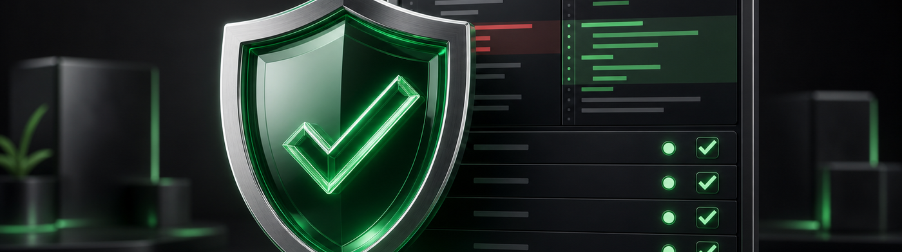

Review Agent
==================

Instantly launch this agent on Agent Relay

A conservative PR reviewer that posts a multi-agent review when a PR opens.
It may auto-apply only lint, formatting, typo, import-order, and other
mechanical non-semantic fixes. Logic changes, safety-sensitive code, lifecycle
or termination paths, and test changes are suggestion/comment-only so a human
author owns them. It sends a message on Slack when a PR is ready for your
review or can merge the PR if you approve.

## Resolving merge conflicts (opt-in)

Comment **`@relay fix conflicts`** on a PR and the agent resolves its merge
conflicts: cloud merges the base branch into the working tree, the agent
resolves the conflict markers (preserving both sides' intent, never weakening
tests or flipping safety defaults), verifies the merged tree against the repo's
CI command, and cloud finalizes and pushes the merge commit. A conflict that
needs human judgment is left in place and called out in a comment rather than
guessed at — so a risky half-merge is never pushed.

This never runs on its own; only an explicit directive comment triggers it, and
only from the PR author or a login in `APPROVERS` / `REVIEW_AUTHORS` (when those
are set). It is enabled by the `conflictResolve` capability in `persona.ts` and
depends on cloud support for the merge-in-tree + finalize-push flow.
